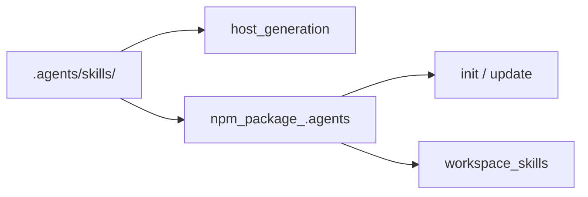

# Design: Collapse Legacy Skill Pipeline

## Architecture

## Decisions

1. **Canonical list** — Extend `REQUIRED_CANONICAL_SKILL_NAMES` with six utility skills migrated from root `skills/`.
2. **No skill codegen** — Delete `generate-templates.js` and workflow skill TS; keep command templates under `src/core/templates/commands/`.
3. **Workspace install** — `readBundledSkillsForWorkflows()` copies `.agents/skills/` content instead of generating from TS.
4. **Profiles** — `CORE_WORKFLOWS = [explore, sync, archive]`; tier skills always via host generation.

## Retired skills

`c3spec-propose`, `c3spec-new-change`, `c3spec-continue-change`, `c3spec-apply-change`, `c3spec-ff-change` — superseded by `c3spec-start` and tier skills.
